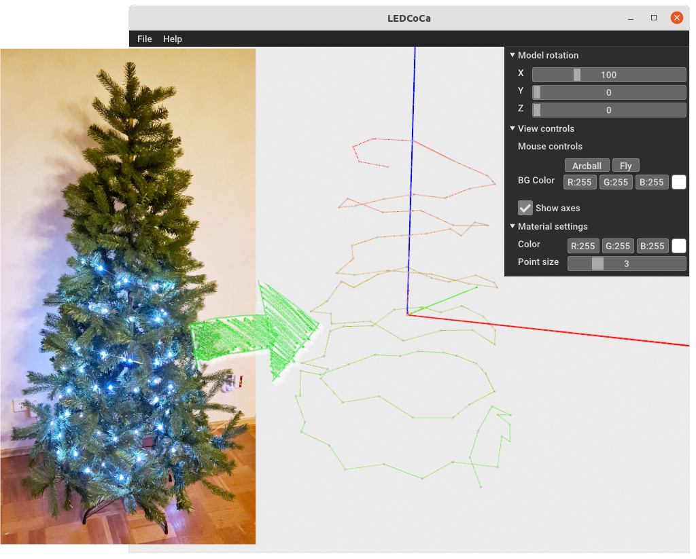
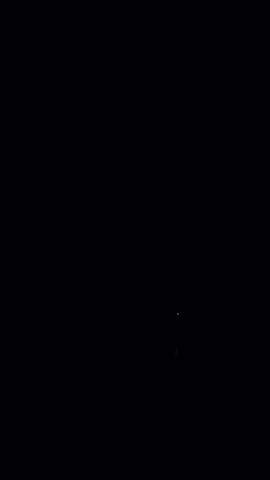
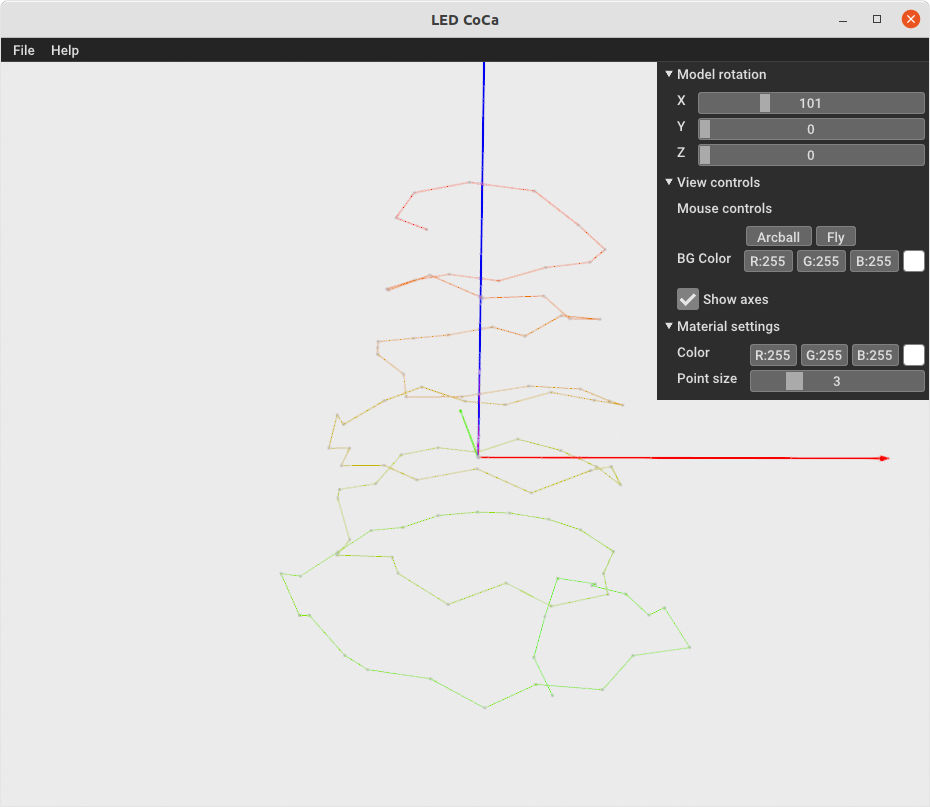

# LED CoCa

LED Coordinate Calculator.

Calculate 3D coordinates of a LED strip with indiviually adressable
LEDs (like WS2812), e.g. on a christmas tree.



The idea came by Matt Parker from [@standupmaths](https://github.com/standupmaths/), and his video
["I wired my tree with 500 LED lights and calculated their 3D coordinates"](https://www.youtube.com/watch?v=TvlpIojusBE)

Reconstruction is done using a [structure from motion](https://en.wikipedia.org/wiki/Structure_from_Motion)
based algorythm. But instead of images, videos from different (arbitrary)
angles are used. In each video all LEDs are lit one after another to identify the
index in the strip.


# Usage
## 1. Calibrate Camera
The first thing to do is to calibrate your camera to get the camera matrix.

Use the `util/camera_calibrate.py` script in this repository. Take a video of a
[checkerboard](images/checkerboard.png) (size 10x7). Circle around with the
camera to shoot the checkerboard from different angles.

Run:
```python camera_calibrate.py --file calibration.mp4```

This will create a file `K.txt` in the directory of the given file containing the
camera matrix.

## 2. Take videos of the LED strip
Then you need to take videos of the LED strip from different angles. Depending
on how many LEDs are obstructed (e.g. by tree branches or decoration) you may need
more or less videos. You don't need to overdo it though. If a LED can't be
reconstructed, it's position is guessed based on it's neighbors.

Use a tripod. Set the exposure of the camera so that the image is black when
no LED is lit.



A python script for the raspberry pi is provided for lighting the LEDs in
`util/neopixel_calibrate.py`. Install the required neopixel library with
`sudo pip3 install adafruit-circuitpython-neopixel`. Also change the number of LEDs
in the script. To indicate the start and end the script will light some LEDs in
a red, green, blue pattern.

## 3. Reconstruct points
Copy the camera matrix file `K.txt` to the root directory wich contains the
videos.

Finally you can run the actual reconstruction.

`python main.py --led_count 100 --root_dir /path/to/video_files/`

You may also set the video file extension if it is not *mp4* with `--video_format mpg`.

After running for a while, a preview of the reconstructed LED strip is shown.
You may change the rotation to fit the real world.



After closing the preview, the results are written into the `points` subdirectory of the
project directory.
- `coords_gift.csv` - Coordinates as a comma separated file with the x, y axis are 
  normalized to range -1 to +1 (GIFT format as defined by [Matt Parker](https://www.youtube.com/watch?v=WuMRJf6B5Q4))
- `coords.npy` - Coordinates as a numpy file
- `*.ply` - A ply file of the model at each step in the reconstruction process


# Requirements

- Python 3
- Numpy
- Opencv-contrib-python == 3.4.2
- Open3D == 0.8.0.0

# References

- Original code: [structure-from-motion](https://github.com/harish-vnkt/structure-from-motion)
- Matt Parkers repositories and videos:
  - [xmastree2021](https://github.com/standupmaths/xmastree2021)
  - [xmastree2020](https://github.com/standupmaths/xmastree2020)
  - [I wired my tree with 500 LED lights and calculated their 3D coordinates.](https://www.youtube.com/watch?v=TvlpIojusBE)
  - [My 500-LED xmas tree got into Harvard.](https://www.youtube.com/watch?v=WuMRJf6B5Q4)
